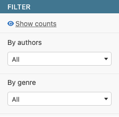
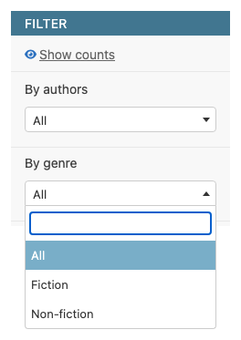
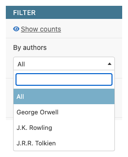
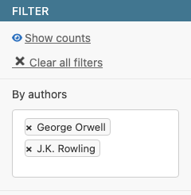

# django-admin-select-filter

[](https://github.com/rodolvbg/django-admin-select-filter/actions/workflows/pytest.yml)
[](https://pypi.org/project/django-admin-select-filter/)
[](https://pypi.org/project/django-admin-select-filter/)
[](https://pypi.org/project/django-admin-select-filter/)
[](https://pepy.tech/project/django-admin-select-filter)

Select2-powered admin list filters for Django.



## Install

```bash
pip install django-admin-select-filter
```

Add to `INSTALLED_APPS`:

```python
INSTALLED_APPS = [
    ...
    "django_admin_select_filter",
]
```

## Usage

### `ChoiceFilter`

The main filter: it works on any field with discrete values — a
`choices`-backed `CharField`/`IntegerField`, a `BooleanField`, or an explicit
`options` list you provide yourself:

```python
from django.contrib import admin
from django_admin_select_filter import ChoiceFilter

from myapp.models import Book


class GenreFilter(ChoiceFilter):
    parameter_name = "genre"  # reads Book.genre.choices


class StatusFilter(ChoiceFilter):
    parameter_name = "status"
    options = [("draft", "Draft"), ("published", "Published")]


@admin.register(Book)
class BookAdmin(admin.ModelAdmin):
    list_filter = [GenreFilter, StatusFilter]
```



Since `options` accepts any explicit `(value, label)` list, `ChoiceFilter`
can even filter a `ForeignKey` — pass one pair per related row:

```python
class AuthorChoiceFilter(ChoiceFilter):
    parameter_name = "author"
    options = [(author.pk, str(author)) for author in Author.objects.all()]
```

This isn't optimal, though: `options` is evaluated once, when the class body
runs (at import time), so it goes stale as rows are added or renamed —
there's no live query, search, or async loading behind it. For a real
`ForeignKey`, use `ForeignKeyFilter` below instead.

### `ForeignKeyFilter`

Built specifically for `ForeignKey`/`ManyToManyField`s: it queries the
related model live, supports searching through the related model's own
`ModelAdmin.search_fields`, and can defer loading options until the widget
is opened (see `async_call` further down).

```python
from django_admin_select_filter import ForeignKeyFilter


class AuthorFilter(ForeignKeyFilter):
    parameter_name = "author"
    ordering = ["name"]


@admin.register(Book)
class BookAdmin(admin.ModelAdmin):
    list_filter = [AuthorFilter]
```



`model` is only needed when it can't be inferred. By default it's resolved by
walking `parameter_name` across `Book`'s relations, following a nested lookup
(e.g. `parameter_name = "author__country"`) segment by segment — forward or
reverse — and taking the last segment's related model. Set `model` explicitly
if the lookup isn't a real relation chain, or to point somewhere else.

### `field_list_filter()`

For a one-off filter that doesn't need its own subclass, use Django's own
`list_filter` shorthand — a `(field_name, filter_class)` tuple — via
`field_list_filter()`:

```python
from django_admin_select_filter import ChoiceFilter, ForeignKeyFilter, field_list_filter


@admin.register(Book)
class BookAdmin(admin.ModelAdmin):
    list_filter = [
        ("author", field_list_filter(ForeignKeyFilter)),
        ("genre", field_list_filter(ChoiceFilter)),
    ]
```

`parameter_name` (and, for `ForeignKeyFilter`, `model`) is inferred from the
field automatically — including a nested lookup like `"author__country"` —
so the same wrapped class can be reused across as many fields as you like.
It only supports `async_call = False`; for an `async_call` filter, define a
dedicated subclass instead (`field_list_filter()` raises `TypeError` right
away if you pass it one, rather than fail silently later).

### Shared options

Both filters share the same options: `filter_only_used_values`, `async_call`,
`searchable`, `nullable` and `title`. Both also support a nested lookup for
`parameter_name` (e.g. `"author__status"`), resolving the field — and, for
`ForeignKeyFilter`, the `model` — by walking each `__`-separated relation in
turn, forward or reverse.

Set `searchable = False` to hide the search input entirely and get a plain
dropdown instead — best for a short, static option list.

Set `multiple = True` to let either filter accept several values at once:

```python
class AuthorFilter(ForeignKeyFilter):
    parameter_name = "author"
    multiple = True
```



Selected values are joined in the query string with `multiple_separator`
(`","` by default) and applied with an `__in` lookup, so configured values
(primary keys, option values) must not contain that character. The "All"
option is dropped in this mode — clearing every selected chip already means
no filter.

## Async options (`async_call = True`)

Set `async_call = True` on a filter to defer loading its options until the
Select2 widget is opened, fetching them over AJAX instead of rendering every
option upfront — useful for a related model with many rows. It requires
wiring an options endpoint: drop `django_admin_select_filter_path()` into
your root `urlpatterns` — no `include()` needed:

```python
# urls.py
from django_admin_select_filter import django_admin_select_filter_path

urlpatterns = [
    ...
    django_admin_select_filter_path(),
]
```

Its route defaults to `django_admin_select_filter/options/`; pass `route` in
case it collides with something else in your project:

```python
django_admin_select_filter_path(route="custom-options/")
```

The endpoint stays reversible as `admin_select_filter:options` either way —
`django_admin_select_filter_path()` still namespaces it internally via
`include()`, that's just no longer something you have to write yourself.
Pass `route`, `view`, `name` or `as_view_kwargs` to customize it further. If
you pass a custom `name`, set `async_call_url` explicitly on every
`async_call` filter to match it — filters resolve the default endpoint by
its default name, and have no way to discover a custom one chosen here.

Each `async_call` filter reads that shared endpoint through
`BaseSelectFilter.async_call_url`, resolved automatically at request time via
`reverse("admin_select_filter:options")`. Set `async_call_url` on a specific
filter to point it at a different view instead:

```python
class AuthorFilter(ForeignKeyFilter):
    parameter_name = "author"
    async_call = True
    async_call_url = "/api/custom-author-options/"
```

If its route shares a prefix with your admin mount (e.g. both under
`admin/`), list `django_admin_select_filter_path()` **before**
`path("admin/", admin.site.urls)`. Since Django 4.1, `AdminSite` registers a
catch-all view (`AdminSite.final_catch_all_view`, enabled by default) that
matches every otherwise-unmatched URL under its own prefix and raises
`Http404` itself — so if the admin mount comes first, it swallows requests to
this app's options endpoint before its URLs ever get a chance to match, and
you'll see a 404 with a full HTML body (the admin's own "Page not found"
page) instead of this app's JSON response.

The filter template loads jQuery/Select2 from Django admin's bundled vendor
assets on demand, so no extra JS dependency is required. Make sure
`django.contrib.staticfiles` is installed and configured.

The endpoint only serves filters with `async_call = True` and requires the
requesting user to have view permission on the target model (checked via
`ModelAdmin.has_view_permission`) — anonymous or unprivileged requests get a
403, and a `parameter_name` matching a non-async filter gets a 404. It looks
the model up across every registered `AdminSite` (not just the default
`django.contrib.admin.site`), so a project using its own `AdminSite` works too.

By default it does this by calling `get_list_filter()` on every matching
`ModelAdmin` on every request. For a project with many admins or filters,
pass `as_view_kwargs={"use_registry": True}` to
`django_admin_select_filter_path()` instead: it resolves filters from a
`{site: {app_label: {model_name: {parameter_name: filter}}}}` map built once
and cached for the process's lifetime (admin registrations are static after
startup), turning that per-request scan into a single dict lookup. The
trade-off: it calls `get_list_filter(request=None)` while building the
cache, so a `get_list_filter()` override that depends on the request isn't
supported in this mode.

## Contributing

See [CONTRIBUTING.md](CONTRIBUTING.md) for development setup, running the
test suite (including the browser-driven e2e tests), and pre-commit hooks.
