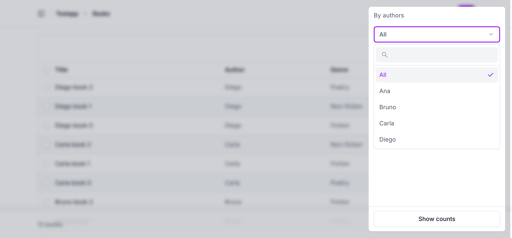
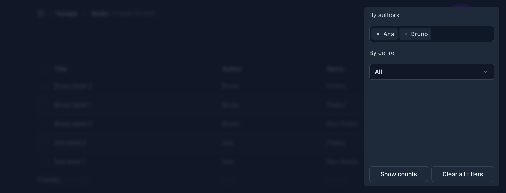

# django-admin-select-filter with django-unfold

## Usage

Works with [django-unfold](https://unfoldadmin.com/) as it is: the filters
render in Unfold's filter panel, and when `unfold` is in `INSTALLED_APPS`
they use the Select2 theme of the admin's autocomplete fields
(`admin-autocomplete`), which Unfold styles, light and dark. Set `theme` on
a filter to choose another Select2 theme yourself. Tested with django-unfold
0.108.

## Screenshots

A filter in Unfold's filter panel, open:

`multiple = True` and an `async_call` filter, in dark mode:

